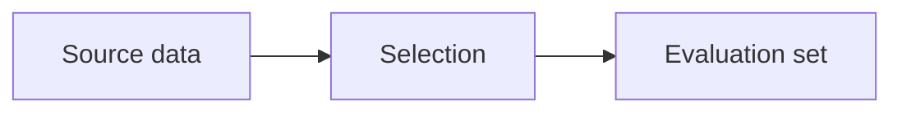

# Syntax and Mathematics

## Compatibility Baseline

CommonMark provides the portable foundation for headings, paragraphs, emphasis, links, images, quotations, lists, and code. Tables, task lists, and strikethrough belong to the GFM extension set. Math, footnotes, diagrams, callouts, and HTML rendering need separate compatibility checks; support for GFM alone does not establish support for all of them. See the [CommonMark specification](https://spec.commonmark.org/0.31.2/) and [GFM specification](https://github.github.io/gfm/).

Prefer the collection's established renderer when known. When unknown, use standard links and ordinary prose as fallbacks and identify any math or media dependency needed by the content. Do not change the user's publishing stack merely to enable decorative formatting.

## Basic Syntax

```markdown
# English Title

## English Section

A connected paragraph with **selective emphasis**, *a term*,
and an inline identifier such as `model_name`.

A new paragraph develops the next point.

[Related note](../related-note/note.md)


> A verified short quotation, with attribution in nearby prose.

- A parallel item.
- Another parallel item.

1. A step whose position matters.
2. The next step.
```

Use blank lines around headings and block elements for reliable, readable source. A blank line separates paragraphs; ordinary newlines within a paragraph are soft breaks. Two trailing spaces or a trailing backslash request a hard break, so avoid them in normal prose. Do not indent ordinary paragraphs by four spaces: that can create a code block. Escape punctuation with a backslash when it would otherwise be interpreted as markup. These behaviors follow [CommonMark](https://spec.commonmark.org/0.31.2/).

For this collection, prefer one coherent paragraph per source line when that prevents accidental rendered breaks, especially with renderers that treat newlines differently. Do not enforce sentence-per-line prose in the rendered document. Use `##` for principal sections and `###` for genuine subdivisions; bold text should not disguise a missing heading hierarchy.

## Paragraphs, Lists, and Indented Blocks

Give each paragraph a coherent purpose, such as a research gap, a mechanism, or an experimental finding with its conditions. Connect evidence and interpretation in the same paragraph or in clearly linked adjacent paragraphs. Break at a change of topic, not after each short sentence. Adjust paragraph length for readability without adopting an arbitrary sentence or word count.

Use bullets for parallel items, numbered lists for order or an explicit numbered set, and prose for causal reasoning, qualifications, and synthesis. If the user asks for a checklist or a compact list, retain the assumptions and interpretation in surrounding prose. If the user asks for prose, convert fragments into connected sentences rather than merely removing bullet markers.

For nested content, align continuation text under the item's content and avoid unnecessary nesting:

```markdown
- **Evaluation scope:** State the scope in a complete sentence.

  Continue this same item's analysis only when it belongs here.
```

Use `>` for a brief attributed quotation or a clearly labeled excerpt. Do not use quotation formatting for your own words in a way that implies the authors wrote them. Indentation alone is not a general-purpose visual callout mechanism; use a short paragraph or a supported blockquote instead.

## Tables

GFM pipe tables support header rows and column alignment. Escape literal pipes inside cells, and keep cells to compact inline content; block paragraphs and nested lists are unsuitable for this format. Task lists use `- [ ]` and `- [x]`, while `~~text~~` requests strikethrough. See the [GFM specification](https://github.github.io/gfm/).

```markdown
| Resource | Role | Verified size |
| --- | --- | ---: |
| [Dataset name] | [Evaluation role] | [Reported count] |
```

Use real verified values in finished notes, never these placeholders. Put units in headers or unambiguous cells. State whether a metric is higher-is-better or lower-is-better, and preserve missing values as explicitly unreported rather than zero. Put shared conditions and source locations in adjacent prose. Avoid bolding every number or treating the maximum as the best result without checking metric direction and comparable settings.

Do not place long argumentation or an entire experiment in a cell. Split setup, results, and interpretation into prose and focused tables. A table is worthwhile when the reader needs to compare repeated fields; a two-column table containing several long paragraphs usually reads better as subsections.

## Code and Literal Examples

Use inline code for filenames, identifiers, and literal syntax. Use fenced code only when exact code, a prompt, a schema, or another literal artifact matters to the analysis. Choose the actual language identifier; `text` is for necessary literal text, not general exposition. Introduce the excerpt, identify its source, and explain its relevance without reproducing unnecessary material.

When documenting a fence inside another fence, make the outer fence longer:

````markdown
```python
score = evaluate(predictions, references)
```
````

Do not turn source prose into JSON or a monospaced block to make it look structured. Examples from the original work and appendix should retain their meaning and provenance; label paraphrases and adaptations clearly.

## Mathematical Notation

In a compatible math renderer, use `$...$` for inline expressions and `$$...$$` for display equations. GitHub also supports a fenced `math` block; it is an alternative rather than a wrapper around dollar-delimited math. These are rendering extensions, not universal CommonMark syntax. See [GitHub's mathematical expression documentation](https://docs.github.com/en/get-started/writing-on-github/working-with-advanced-formatting/writing-mathematical-expressions).

Use inline notation for a short variable or relationship that belongs in a sentence. Use display math for a central expression that would be hard to scan inline:

```markdown
The illustrative average loss is $\bar{\ell}$ over $N$ examples.

$$
\bar{\ell} = \frac{1}{N}\sum_{i=1}^{N}\ell_i.
$$

Here, $N$ is the number of examples and $\ell_i$ is the loss for example $i$.
```

This equation is a syntax example, not a paper's reported objective. In actual notes, preserve the source's definitions, domains, indexing, assumptions, and units. Define symbols near first use, and distinguish a newly derived formula from the paper's original equation.

Common LaTeX forms include subscripts `x_i`, superscripts `x^{2}`, fractions `\frac{a}{b}`, roots `\sqrt{x}`, Greek symbols `\alpha`, sums `\sum_{i=1}^{N}`, bold vectors `\mathbf{x}`, and text inside equations `\text{where}`. Group multi-character indices with braces. Keep mathematical operators and prose spacing legible; do not put ordinary narrative paragraphs inside math delimiters.

For a long equation, break it at meaningful algebraic boundaries in an `aligned` environment when the renderer supports it:

```markdown
$$
\begin{aligned}
L &= L_{\mathrm{data}} + \lambda L_{\mathrm{reg}}, \\
L_{\mathrm{data}} &= \frac{1}{N}\sum_{i=1}^{N}\ell_i.
\end{aligned}
$$
```

Do not shrink an equation until it is unreadable or insert arbitrary breaks that change grouping. Avoid custom macros unless the target environment defines them. Equation numbering and cross-references vary by renderer; a visible source locator such as "original Eq. (4)" is more portable than assuming automatic numbering.

Outside examples, do not wrap math in code ticks when it should render. Check dollar signs used as currency near math for parser ambiguity; writing the currency name is a portable alternative. If math rendering is unavailable, use readable plain notation for simple expressions or an accurately sourced equation image with a textual description for complex ones. Never replace a formula with a fabricated approximation.

## Optional Extensions

Select extensions for a specific reading need, not to decorate every section.

| Feature | Typical syntax | Collection use and fallback |
| --- | --- | --- |
| Footnotes | `Claim.[^scope]` and `[^scope]: Qualification.` | Brief secondary notes; use parenthetical prose or a References entry if unsupported |
| Task lists | `- [ ] Check source` | Working review tasks or a requested checklist; avoid unfinished tasks in a completed synthesis |
| Strikethrough | `~~superseded~~` | An explicitly requested revision view; finished notes should present the corrected statement clearly |
| Collapsible HTML | `<details><summary>Additional detail</summary>...</details>` | Optional lengthy supporting detail; keep conclusions and required analysis visible |
| Mermaid | A fenced block labeled `mermaid` | A small faithful process diagram; use an asset or prose if unsupported |
| Callouts | Renderer-specific syntax | An occasional essential qualification; default to ordinary prose |
| YAML frontmatter | A leading fenced YAML metadata block | Only if the collection's tooling needs it; it does not replace visible source context |
| Raw HTML | Such as `` | Only after checking rendering and sanitization; retain a Markdown fallback |

Footnotes and platform-specific formatting are described in [GitHub's basic formatting guide](https://docs.github.com/en/get-started/writing-on-github/getting-started-with-writing-and-formatting-on-github/basic-writing-and-formatting-syntax). Do not assume wiki links, transclusion, highlight markers, definition lists, or custom heading IDs work outside the application that supplies them.

For supported collapsible sections, separate the inner Markdown from HTML tags with blank lines and provide a meaningful summary. Do not collapse experimental conditions essential to interpreting the displayed results. See [GitHub's collapsed-section documentation](https://docs.github.com/en/get-started/writing-on-github/working-with-advanced-formatting/organizing-information-with-collapsed-sections).

Mermaid can be embedded in supported renderers using a `mermaid` fence; supported versions matter. See [GitHub's diagram documentation](https://docs.github.com/en/get-started/writing-on-github/working-with-advanced-formatting/creating-diagrams). A brief left-to-right illustration is:

````markdown

````

Use that structure only if it faithfully represents the actual method. Label a diagram drawn for the note as a synthesis, preserve uncertainty, and store any exported image in `assets/`.
